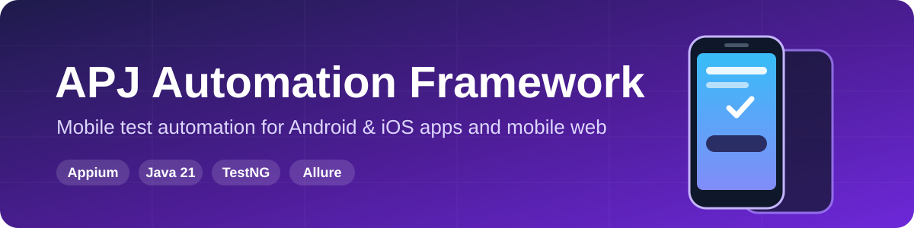
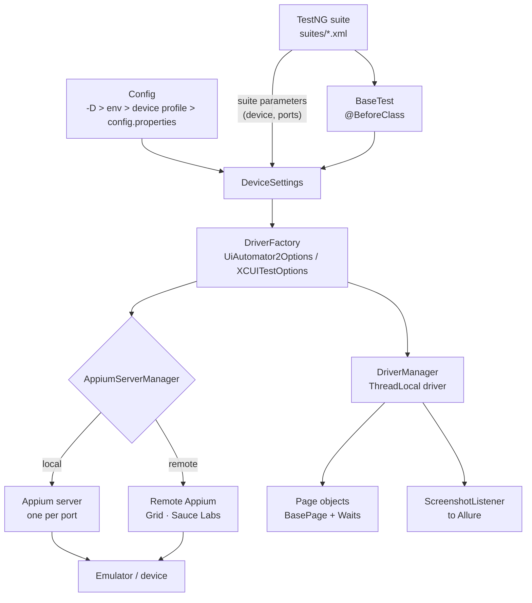

<p align="center">
  
</p>

<p align="center">
  <a href="https://github.com/Alexxfromgit/TAF-Appium-JAVA/actions/workflows/ci.yml"></a>
  
  
  
  
  
  
  
  <a href="LICENSE"></a>
</p>

<p align="center">
  A test automation framework for <b>Android and iOS native apps</b> and <b>mobile web</b>.<br>
  One base class, typed W3C capabilities, parallel runs across devices, Allure reports.
</p>

<p align="center">
  <a href="#quick-start">Quick start</a> ·
  <a href="#running-tests">Running tests</a> ·
  <a href="#configuration">Configuration</a> ·
  <a href="#writing-tests">Writing tests</a> ·
  <a href="#reports--artifacts">Reports</a> ·
  <a href="#troubleshooting">Troubleshooting</a>
</p>

---

## Features

| | |
|---|---|
| **Native & web** | The same `BaseTest` covers native apps (`Target.app(...)`) and mobile browsers (`Target.browser(...)`). |
| **Parallel devices** | Drivers are held per thread, so the same classes run on several devices at once from a single suite file. |
| **Local or remote Appium** | The framework starts an Appium server per port, or connects to an existing server, a Grid or Sauce Labs. |
| **Layered config** | `config.properties` -> device profile -> environment variables -> `-D` flags. |
| **No sleeps** | Page objects wait for elements explicitly through `BasePage` and `Waits`. |
| **Reporting** | Allure report with `@Step`s, plus screenshots on failure that include the device name. |
| **iOS ready** | `platform=ios` switches to `IOSDriver` with `XCUITestOptions`. |
| **CI** | GitHub Actions compiles the project, runs the device-free tests and validates every suite. |

## Architecture



<details>
<summary><b>Project structure</b></summary>

```text
src/main/java/com/apj/framework
├── BaseTest.java                  session lifecycle, TestNG parameter overrides
├── config/Config.java             layered configuration
├── driver/
│   ├── DriverFactory.java         UiAutomator2 / XCUITest options, Sauce Labs options
│   ├── DriverManager.java         ThreadLocal driver holder
│   ├── AppiumServerManager.java   local server per port, or remote URL
│   ├── DeviceSettings.java        device from config + suite overrides
│   └── Target.java, Platform.java
├── pages/BasePage.java            PageFactory + AppiumFieldDecorator, tap/type/textOf
├── waits/Waits.java               explicit waits
└── listeners/ScreenshotListener.java

src/test/java/com/apj/tests
├── app/        MentoringAppTests, GameFTests      native apps
├── web/        ChromeWebTests                     mobile Chrome
├── samples/    ApiDemos*Test                      official Appium ApiDemos samples
├── pages/      screen and page objects
└── unit/       FrameworkConfigTest                no device needed

src/test/resources
├── config.properties              default configuration
├── devices/*.properties           device profiles        (-Ddevice=<name>)
├── suites/*.xml                   TestNG suites          (-Psuite=<name>)
└── apps/                          applications under test
```

</details>

## Quick start

### 1. Install the prerequisites

| Tool | Version | Install |
|------|---------|---------|
| JDK | 21 | picked up automatically through Gradle toolchains |
| Node.js | 20.19+ (LTS) | https://nodejs.org |
| Appium | 3.x | `npm install -g appium` |
| UiAutomator2 driver | latest | `appium driver install uiautomator2` |
| XCUITest driver *(macOS, optional)* | latest | `appium driver install xcuitest` |
| Android SDK | platform-tools, emulator, cmdline-tools | Android Studio or the command-line tools; set `ANDROID_HOME` |
| Appium Inspector *(optional)* | latest | [releases](https://github.com/appium/appium-inspector/releases), for finding locators |

To check the Android setup:

```shell
appium driver doctor uiautomator2
```

### 2. Start a device

Create an emulator in Android Studio (**Device Manager > Create Virtual Device**) or on the command line:

```shell
sdkmanager "system-images;android-33;google_apis;x86_64"
avdmanager create avd -n Pixel_API_33 -k "system-images;android-33;google_apis;x86_64" -d pixel_6
emulator -avd Pixel_API_33
```

> [!IMPORTANT]
> `Mentoring.apk` targets SDK 17, and **Android 14+ blocks installing apps that target SDK < 23**.
> Use an Android 13 (API 33) or older image for it. See [Troubleshooting](#troubleshooting) for a workaround.

### 3. Point the framework at the device

```shell
adb devices                                   # device name / serial, e.g. emulator-5554
adb shell getprop ro.build.version.release    # platform version, e.g. 13
```

Put the values into `src/test/resources/config.properties`, use a device profile, or pass them as flags:

```shell
./gradlew test -Psuite=mentoring -Ddevice=android-13-emulator
./gradlew test -Psuite=mentoring -Dandroid.device.name=emulator-5554 -Dandroid.platform.version=13
```

For a physical device, set `android.udid` to the serial from `adb devices` (see `devices/android-real-device.properties`).

### 4. Run

```shell
git clone https://github.com/Alexxfromgit/TAF-Appium-JAVA.git
cd TAF-Appium-JAVA
./gradlew test -Psuite=mentoring
```

The framework starts the Appium server itself, so you don't need to launch it by hand.

## Running tests

Choose a suite with `-Psuite=<name>`. The files live in `src/test/resources/suites/`.

| Suite | Command | What runs | Needs a device |
|-------|---------|-----------|--------|
| `unit` | `./gradlew test` | framework tests (the default suite) | no |
| `mentoring` | `./gradlew test -Psuite=mentoring` | Mentoring app | yes |
| `gamef` | `./gradlew test -Psuite=gamef` | GameF (Unity) app | yes |
| `web` | `./gradlew test -Psuite=web` | mobile Chrome against [the-internet](https://the-internet.herokuapp.com) | yes |
| `samples` | `./gradlew downloadApiDemos test -Psuite=samples` | Appium ApiDemos samples (downloads the APK first) | yes |
| `regression` | `./gradlew test -Psuite=regression` | mentoring + gamef + web | yes |
| `parallel` | `./gradlew test -Psuite=parallel` | app tests on **two emulators at once** | 2 devices |

> [!TIP]
> Add `-Dtestng.mode.dryrun=true` to list a suite's tests without opening any session. CI uses this to validate every suite.

### Parallel execution

`suites/parallel.xml` has one `<test>` block per device, and TestNG runs each block on its own thread.
Every device needs its own `udid`, `appiumPort` and `systemPort`:

```xml
<suite name="Parallel Devices" parallel="tests" thread-count="2">
    <test name="Emulator 5554 - Android 13">
        <parameter name="udid" value="emulator-5554"/>
        <parameter name="appiumPort" value="4723"/>
        <parameter name="systemPort" value="8200"/>
        ...
```

To add a device, copy a block, give it unique ports and raise `thread-count`.

### Appium server modes

| Mode | Setting | Use when |
|------|---------|----------|
| **Local** *(default)* | `appium.server.mode=local` | Appium is installed on this machine. One server is started per port and stopped after the suite. |
| **Remote** | `-Dappium.server.mode=remote -Dappium.server.url=http://host:4723/` | You run Appium yourself, or use a Grid or a cloud provider. |

If you start the server yourself, run `appium --allow-insecure uiautomator2:chromedriver_autodownload`, so it
downloads the Chromedriver that matches the device's Chrome for web tests. The local mode enables this automatically.

## Configuration

Each key is looked up in this order, and the first match wins:

```text
-Dkey=value  ->  env KEY_NAME  ->  devices/<device>.properties  ->  config.properties
```

<details>
<summary><b>Configuration reference</b></summary>

| Key | Default | Description |
|-----|---------|-------------|
| `platform` | `android` | `android` or `ios` |
| `appium.server.mode` | `local` | `local` starts Appium; `remote` uses `appium.server.url` |
| `appium.server.url` | `http://127.0.0.1:4723/` | remote server, Grid or cloud URL (Appium 2+ has no `/wd/hub`) |
| `appium.port` | `4723` | port of the local server |
| `appium.node.path`, `appium.js.path` | - | only needed when Appium can't be found automatically |
| `android.device.name`, `android.platform.version`, `android.udid` | `emulator-5554`, `13` | target device |
| `android.app.<key>.path` / `.package` / `.activity` | - | app under test, used as `Target.app("<key>")` |
| `ios.device.name`, `ios.platform.version`, `ios.udid` | - | iOS device |
| `ios.app.<key>.path` / `.bundle.id` | - | iOS app under test |
| `app.no.reset`, `app.full.reset` | `false` | app reset strategy |
| `wait.implicit`, `wait.explicit` | `10`, `15` | timeouts in seconds |
| `screenshots.on.success` | `false` | also capture screenshots of passed tests |
| `web.base.url`, `web.browser` | the-internet, `Chrome` | mobile web tests |
| `sauce.username`, `sauce.access.key` | - | enable Sauce Labs (use env `SAUCE_USERNAME` / `SAUCE_ACCESS_KEY`) |
| `sauce.build`, `sauce.appium.version` | - | optional Sauce Labs settings |

</details>

<details>
<summary><b>iOS</b></summary>

With `platform=ios`, `DriverFactory` creates an `IOSDriver` with `XCUITestOptions`, and `systemPort` becomes
the WDA local port. To share page objects between platforms, put `@iOSXCUITFindBy` next to `@AndroidFindBy`.

```shell
./gradlew test -Psuite=<suite> -Dplatform=ios \
  -Dios.device.name="iPhone 16" -Dios.platform.version=18.0
```

</details>

<details>
<summary><b>Sauce Labs</b></summary>

`sauce:options` are added automatically when `sauce.username` is set.

```shell
export SAUCE_USERNAME=... SAUCE_ACCESS_KEY=...
./gradlew test -Psuite=web -Dappium.server.mode=remote \
  -Dappium.server.url=https://ondemand.eu-central-1.saucelabs.com:443/wd/hub \
  -Dandroid.device.name="Google Pixel.*" -Dandroid.platform.version=14
```

For native apps, upload the APK to Sauce storage and set `android.app.<key>.path=storage:filename=<name>.apk`.

</details>

## Writing tests

**1. Register the app** in `config.properties`:

```properties
android.app.myapp.path=src/test/resources/apps/MyApp.apk
```

**2. Create a page object.** Its helpers wait for the element before acting:

```java
public class MyHomeScreen extends BasePage {

    @AndroidFindBy(id = "com.example.myapp:id/title")
    @iOSXCUITFindBy(accessibility = "title")
    private WebElement title;

    public String title() {
        return textOf(title);
    }
}
```

**3. Write the test:**

```java
public class MyAppTests extends BaseTest {

    @Override
    protected Target target() {
        return Target.app("myapp");      // or Target.browser("Chrome")
    }

    @Test
    public void showsTitle() {
        assertThat(new MyHomeScreen().title()).isEqualTo("Hello");
    }
}
```

**4. Add the class to a suite** in `src/test/resources/suites/`.

## Reports & artifacts

| Artifact | Location |
|----------|----------|
| Allure report | `./gradlew allureServe` · or `./gradlew allureReport` -> `build/reports/allure-report` |
| Gradle test report | `build/reports/tests/test/index.html` |
| Screenshots | `build/screenshots/failures/<test>_<Class.method>_<timestamp>.png` (also attached to Allure) |
| Framework log | `build/logs/tests.log` |
| Appium server log | `build/logs/appium-<port>.log` |

## Continuous integration

[`.github/workflows/ci.yml`](.github/workflows/ci.yml) runs on every push to `master` and on every pull request:

1. runs the device-free `unit` suite on JDK 21
2. dry-runs every device suite, which checks the suite XML, the classes and the parameters
3. uploads the test reports and Allure results as artifacts

The CI runner has no device, so run the device suites locally or against a cloud provider.

## Troubleshooting

<details>
<summary><b><code>INSTALL_FAILED_DEPRECATED_SDK_VERSION</code> on Android 14+</b></summary>

`Mentoring.apk` targets SDK 17. Either use an API 33 or older emulator, or pre-install the app and skip reinstalling it:

```shell
adb install --bypass-low-target-sdk-block src/test/resources/apps/Mentoring.apk
./gradlew test -Psuite=mentoring -Dapp.no.reset=true
```

</details>

<details>
<summary><b><code>The main Appium script does not exist</code></b></summary>

The framework can't find Appium. Install it with `npm install -g appium`, or point to it:
`-Dappium.node.path=/path/to/node -Dappium.js.path=/path/to/appium/index.js`.
To use a server you started yourself, pass `-Dappium.server.mode=remote`.

</details>

<details>
<summary><b>Port conflicts in parallel runs</b></summary>

Every `<test>` block needs a unique `appiumPort` and `systemPort`. Check for a leftover server with
`netstat -ano | findstr 4723` (Windows) or `lsof -i :4723` (macOS/Linux).

</details>

<details>
<summary><b>Chromedriver version mismatch in web tests</b></summary>

A server started by the framework downloads the matching Chromedriver automatically. For a server you started
yourself, add `--allow-insecure uiautomator2:chromedriver_autodownload`.

</details>

## Contributing

Issues and pull requests are welcome. See [CONTRIBUTING.md](CONTRIBUTING.md).

## License

[MIT](LICENSE)
