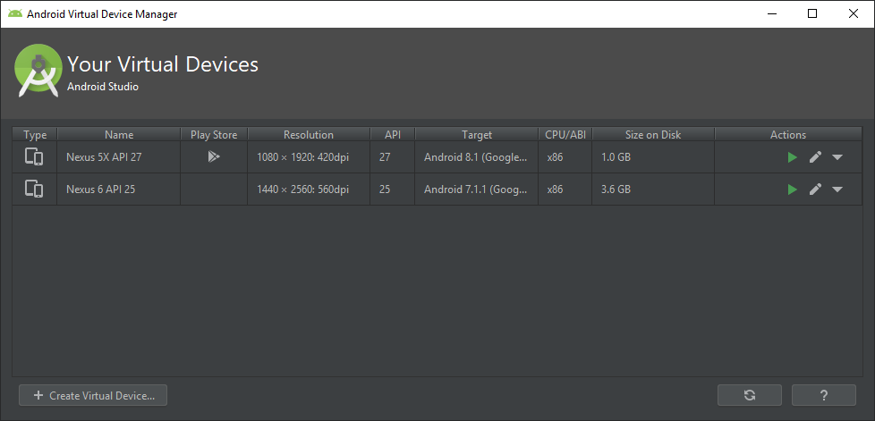
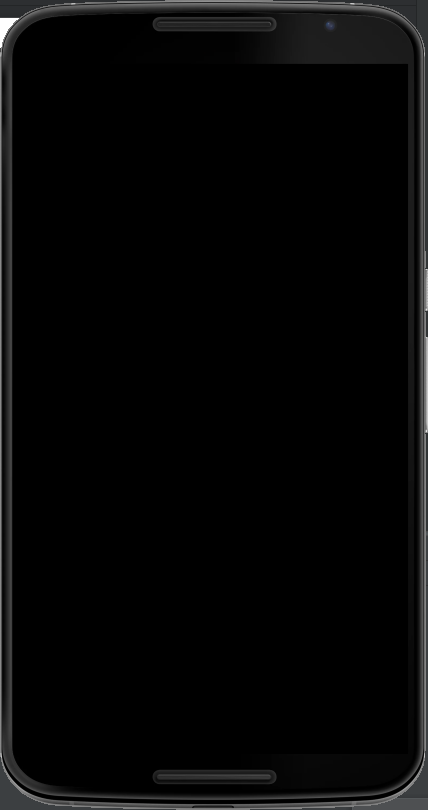

## Automation Framework for mobile testing using Appium

<p align="center">
  

  

</p>

Test automation framework for Android (and iOS) native apps and mobile web, built on
**Java 21 · Appium java-client 10 (Selenium 4, W3C) · TestNG 7 · Gradle 9 · Allure**.

* one base class for native app and mobile browser sessions
* thread-safe drivers, so the same tests run on several devices in parallel
* the framework can start its own local Appium server, or connect to a remote one (Grid, Sauce Labs)
* layered configuration: `config.properties` → device profile → env variables → `-D` flags
* screenshots on failure, attached to the Allure report

## Project structure

```
src/main/java/com/apj/framework
├── BaseTest.java              session lifecycle, TestNG parameter overrides
├── config/Config.java         layered configuration
├── driver/                    DriverFactory (UiAutomator2 / XCUITest options), DriverManager (ThreadLocal),
│                              AppiumServerManager (local or remote server), DeviceSettings, Target
├── pages/BasePage.java        PageFactory + AppiumFieldDecorator, explicit-wait helpers
├── waits/Waits.java           explicit waits (no static sleeps)
└── listeners/ScreenshotListener.java

src/test/java/com/apj/tests
├── app/        MentoringAppTests, GameFTests            native apps from src/test/resources/apps
├── web/        ChromeWebTests                            mobile Chrome
├── samples/    ApiDemos*Test                             official Appium ApiDemos samples
├── pages/      screen / page objects
└── unit/       FrameworkConfigTest                       no device needed (runs in CI)

src/test/resources
├── config.properties          default configuration
├── devices/*.properties       device profiles, selected with -Ddevice=<name>
├── suites/*.xml               TestNG suites, selected with -Psuite=<name>
└── apps/                      applications under test
```

# Guide

```shell
git clone git@github.com:Alexxfromgit/apj_automation_framework.git
```

#### Step 1 - Install the tools

| Tool | Notes |
|------|-------|
| JDK 21 | Gradle toolchains pick it up automatically |
| Node.js 20.19+ (LTS) | needed by Appium |
| Appium 3 | `npm install -g appium` |
| UiAutomator2 driver | `appium driver install uiautomator2` |
| XCUITest driver (macOS, optional) | `appium driver install xcuitest` |
| Android SDK | Android Studio, or command-line tools; set `ANDROID_HOME` |
| Appium Inspector (optional) | for inspecting element locators: https://github.com/appium/appium-inspector/releases |

Check the Android setup with `appium driver doctor uiautomator2`.

#### Step 2 - Prepare a virtual device

Create a device in Android Studio (*Device Manager*) or on the command line:



```shell
sdkmanager "system-images;android-33;google_apis;x86_64"
avdmanager create avd -n Pixel_API_33 -k "system-images;android-33;google_apis;x86_64" -d pixel_6
emulator -list-avds
emulator -avd Pixel_API_33
```



> **Note:** `Mentoring.apk` targets SDK 17. Android 14+ refuses to install apps that target
> SDK < 23, so use an Android 13 (API 33) or older image for it. You can also pre-install it with
> `adb install --bypass-low-target-sdk-block src/test/resources/apps/Mentoring.apk` and then
> set `app.no.reset=true`.

#### Step 3 - Point the framework at your device

```shell
adb devices                                   # device name / serial, e.g. emulator-5554
adb shell getprop ro.build.version.release    # platform version, e.g. 13
```

Put the values into `src/test/resources/config.properties` (`android.device.name`, `android.platform.version`)
or into a profile under `src/test/resources/devices/`. You can also pass them on the command line:

```shell
./gradlew test -Psuite=mentoring -Dandroid.device.name=emulator-5554 -Dandroid.platform.version=13
./gradlew test -Psuite=mentoring -Ddevice=android-13-emulator
```

To use a physical device, set `android.udid` to the `adb devices` serial (see `devices/android-real-device.properties`).

#### Step 4 - Run the tests

By default the framework starts the Appium server itself (`appium.server.mode=local`), so `appium` must be on
the `PATH` (or set `appium.node.path` / `appium.js.path`). To use a server you started yourself, run it with
`appium --allow-insecure uiautomator2:chromedriver_autodownload` and pass `-Dappium.server.mode=remote`.

| Command | What runs |
|---------|-----------|
| `./gradlew test` | framework unit tests, no device needed (suite `unit`) |
| `./gradlew test -Psuite=mentoring` | Mentoring app |
| `./gradlew test -Psuite=gamef` | GameF (Unity) app |
| `./gradlew test -Psuite=web` | mobile Chrome against https://the-internet.herokuapp.com |
| `./gradlew downloadApiDemos test -Psuite=samples` | Appium ApiDemos samples (downloads the APK first) |
| `./gradlew test -Psuite=regression` | mentoring + gamef + web |
| `./gradlew test -Psuite=parallel` | app tests on **two emulators in parallel** |
| `./gradlew test -Psuite=<any> -Dtestng.mode.dryrun=true` | lists the tests without running them |

**Parallel runs:** `suites/parallel.xml` has one `<test>` block per device. Each block gives the device its own
`udid`, `appiumPort` and `systemPort`, and TestNG runs the blocks in separate threads. To add a device,
copy a block and give it unique ports.

For mobile web, the Chromedriver that matches the device's Chrome is downloaded automatically. The local server
is started with the `uiautomator2:chromedriver_autodownload` insecure feature for this.

#### Step 5 - Reports

* Gradle HTML report: `build/reports/tests/test/index.html`
* Allure: `./gradlew allureServe` (or `allureReport` → `build/reports/allure-report`)
* Screenshots of failed tests: `build/screenshots/failures` (also attached to Allure). To capture passed tests too, add `-Dscreenshots.on.success=true`
* Logs: `build/logs/tests.log` and `build/logs/appium-<port>.log`

## Configuration reference

Values are looked up in this order: `-Dkey=value` → env variable `KEY_NAME` → `devices/<device>.properties` → `config.properties`.

| Key | Default | Meaning |
|-----|---------|---------|
| `platform` | `android` | `android` or `ios` |
| `appium.server.mode` | `local` | `local` starts Appium; `remote` uses `appium.server.url` |
| `appium.server.url` | `http://127.0.0.1:4723/` | remote server / grid / cloud URL (Appium 2+ has no `/wd/hub`) |
| `android.device.name`, `android.platform.version`, `android.udid` | | target device |
| `android.app.<key>.path` / `.package` / `.activity` | | application under test, referenced as `Target.app("<key>")` |
| `ios.device.name`, `ios.platform.version`, `ios.udid`, `ios.app.<key>.path` / `.bundle.id` | | iOS equivalents |
| `wait.implicit` / `wait.explicit` | `10` / `15` | seconds |
| `web.base.url`, `web.browser` | the-internet, `Chrome` | mobile web tests |

### iOS

The driver factory creates an `IOSDriver` with `XCUITestOptions` when `platform=ios`. Use `@iOSXCUITFindBy`
next to `@AndroidFindBy` in page objects to share them between platforms:

```shell
./gradlew test -Psuite=<suite> -Dplatform=ios -Dios.device.name="iPhone 16" -Dios.platform.version=18.0
```

### Sauce Labs / cloud

```shell
export SAUCE_USERNAME=... SAUCE_ACCESS_KEY=...
./gradlew test -Psuite=web -Dappium.server.mode=remote \
  -Dappium.server.url=https://ondemand.eu-central-1.saucelabs.com:443/wd/hub \
  -Dandroid.device.name="Google Pixel.*" -Dandroid.platform.version=14
```

`sauce:options` are added automatically when `sauce.username` is set (optionally `sauce.build`, `sauce.appium.version`). For native apps, upload the app to
Sauce storage and set `android.app.<key>.path=storage:filename=<name>.apk`.

### Writing a test

```java
public class MyAppTests extends BaseTest {

    @Override
    protected Target target() {
        return Target.app("myapp");          // needs android.app.myapp.path in config.properties
    }

    @Test
    public void somethingWorks() {
        assertThat(new MyHomeScreen().title()).isEqualTo("Hello");
    }
}
```

Page objects extend `BasePage` and use `tap(...)`, `type(...)`, `textOf(...)` and `waits`. These wait
for the element, so tests don't need `Thread.sleep`.
